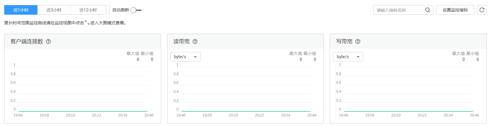

# SFS Turbo监控指标说明

## 功能说明

本节定义了云文件上报云监控的监控指标的命名空间，监控指标列表和维度定义，用户可以通过管理控制台或云监控提供的[API接口](https://support.huaweicloud.com/api-ces/zh-cn_topic_0171212514.html)来查询监控指标。

## 命名空间

SYS.EFS

## 监控指标

<table><thead align="left"><tr id="row726893842214"><th class="cellrowborder" valign="top" width="15.151515151515152%" id="mcps1.1.6.1.1">
指标

</th>
<th class="cellrowborder" valign="top" width="16.161616161616163%" id="mcps1.1.6.1.2">
指标名称

</th>
<th class="cellrowborder" valign="top" width="36.36363636363637%" id="mcps1.1.6.1.3">
含义

</th>
<th class="cellrowborder" valign="top" width="11.111111111111112%" id="mcps1.1.6.1.4">
取值范围

</th>
<th class="cellrowborder" valign="top" width="21.21212121212121%" id="mcps1.1.6.1.5">
测量对象

</th>
</tr>
</thead>
<tbody><tr id="row2272193812219"><td class="cellrowborder" valign="top" width="15.151515151515152%" headers="mcps1.1.6.1.1 ">
client_connections

</td>
<td class="cellrowborder" valign="top" width="16.161616161616163%" headers="mcps1.1.6.1.2 ">
客户端连接数

</td>
<td class="cellrowborder" valign="top" width="36.36363636363637%" headers="mcps1.1.6.1.3 ">
该指标用于统计测量客户端连接数。

</td>
<td class="cellrowborder" valign="top" width="11.111111111111112%" headers="mcps1.1.6.1.4 ">
≥ 0

</td>
<td class="cellrowborder" valign="top" width="21.21212121212121%" headers="mcps1.1.6.1.5 ">
云文件

</td>
</tr>
<tr id="row22801038122214"><td class="cellrowborder" valign="top" width="15.151515151515152%" headers="mcps1.1.6.1.1 ">
data_read_io_bytes

</td>
<td class="cellrowborder" valign="top" width="16.161616161616163%" headers="mcps1.1.6.1.2 ">
读带宽

</td>
<td class="cellrowborder" valign="top" width="36.36363636363637%" headers="mcps1.1.6.1.3 ">
该指标用于测量读I/O负载。

单位：byte/s

</td>
<td class="cellrowborder" valign="top" width="11.111111111111112%" headers="mcps1.1.6.1.4 ">
≥ 0 bytes/s

</td>
<td class="cellrowborder" valign="top" width="21.21212121212121%" headers="mcps1.1.6.1.5 ">
云文件

</td>
</tr>
<tr id="row16283638112211"><td class="cellrowborder" valign="top" width="15.151515151515152%" headers="mcps1.1.6.1.1 ">
data_write_io_bytes

</td>
<td class="cellrowborder" valign="top" width="16.161616161616163%" headers="mcps1.1.6.1.2 ">
写带宽

</td>
<td class="cellrowborder" valign="top" width="36.36363636363637%" headers="mcps1.1.6.1.3 ">
该指标用于测量写I/O负载。

单位：byte/s

</td>
<td class="cellrowborder" valign="top" width="11.111111111111112%" headers="mcps1.1.6.1.4 ">
≥ 0 bytes/s

</td>
<td class="cellrowborder" valign="top" width="21.21212121212121%" headers="mcps1.1.6.1.5 ">
云文件

</td>
</tr>
<tr id="row102875381228"><td class="cellrowborder" valign="top" width="15.151515151515152%" headers="mcps1.1.6.1.1 ">
metadata_io_bytes

</td>
<td class="cellrowborder" valign="top" width="16.161616161616163%" headers="mcps1.1.6.1.2 ">
元数据读写带宽

</td>
<td class="cellrowborder" valign="top" width="36.36363636363637%" headers="mcps1.1.6.1.3 ">
该指标用于测量元数据读写I/O负载。

单位：byte/s

</td>
<td class="cellrowborder" valign="top" width="11.111111111111112%" headers="mcps1.1.6.1.4 ">
≥ 0 bytes/s

</td>
<td class="cellrowborder" valign="top" width="21.21212121212121%" headers="mcps1.1.6.1.5 ">
云文件

</td>
</tr>
<tr id="row1037910119139"><td class="cellrowborder" valign="top" width="15.151515151515152%" headers="mcps1.1.6.1.1 ">
total_io_bytes

</td>
<td class="cellrowborder" valign="top" width="16.161616161616163%" headers="mcps1.1.6.1.2 ">
总带宽

</td>
<td class="cellrowborder" valign="top" width="36.36363636363637%" headers="mcps1.1.6.1.3 ">
该指标用于测量总I/O负载。

单位：byte/s

</td>
<td class="cellrowborder" valign="top" width="11.111111111111112%" headers="mcps1.1.6.1.4 ">
≥ 0 bytes/s

</td>
<td class="cellrowborder" valign="top" width="21.21212121212121%" headers="mcps1.1.6.1.5 ">
云文件

</td>
</tr>
<tr id="row31591714161313"><td class="cellrowborder" valign="top" width="15.151515151515152%" headers="mcps1.1.6.1.1 ">
iops

</td>
<td class="cellrowborder" valign="top" width="16.161616161616163%" headers="mcps1.1.6.1.2 ">
IOPS

</td>
<td class="cellrowborder" valign="top" width="36.36363636363637%" headers="mcps1.1.6.1.3 ">
该指标用于测量单位时间内处理的I/O数。

</td>
<td class="cellrowborder" valign="top" width="11.111111111111112%" headers="mcps1.1.6.1.4 ">
≥ 0

</td>
<td class="cellrowborder" valign="top" width="21.21212121212121%" headers="mcps1.1.6.1.5 ">
云文件

</td>
</tr>
<tr id="row13829184911438"><td class="cellrowborder" valign="top" width="15.151515151515152%" headers="mcps1.1.6.1.1 ">
used_capacity

</td>
<td class="cellrowborder" valign="top" width="16.161616161616163%" headers="mcps1.1.6.1.2 ">
已用容量

</td>
<td class="cellrowborder" valign="top" width="36.36363636363637%" headers="mcps1.1.6.1.3 ">
该指标用于统计文件系统已用容量。

单位：byte

</td>
<td class="cellrowborder" valign="top" width="11.111111111111112%" headers="mcps1.1.6.1.4 ">
≥ 0 bytes

</td>
<td class="cellrowborder" valign="top" width="21.21212121212121%" headers="mcps1.1.6.1.5 ">
云文件

</td>
</tr>
<tr id="row5677125244310"><td class="cellrowborder" valign="top" width="15.151515151515152%" headers="mcps1.1.6.1.1 ">
used_capacity_percent

</td>
<td class="cellrowborder" valign="top" width="16.161616161616163%" headers="mcps1.1.6.1.2 ">
容量使用率

</td>
<td class="cellrowborder" valign="top" width="36.36363636363637%" headers="mcps1.1.6.1.3 ">
该指标用于统计文件系统已用容量占总容量的比例。

单位：百分比

</td>
<td class="cellrowborder" valign="top" width="11.111111111111112%" headers="mcps1.1.6.1.4 ">
0 - 100%

</td>
<td class="cellrowborder" valign="top" width="21.21212121212121%" headers="mcps1.1.6.1.5 ">
云文件

</td>
</tr>
</tbody>
</table>

## 维度

<table><thead align="left"><tr id="row13292153862219"><th class="cellrowborder" valign="top" width="40.400000000000006%" id="mcps1.1.3.1.1">
Key

</th>
<th class="cellrowborder" valign="top" width="59.599999999999994%" id="mcps1.1.3.1.2">
Value

</th>
</tr>
</thead>
<tbody><tr id="row1429373812228"><td class="cellrowborder" valign="top" width="40.400000000000006%" headers="mcps1.1.3.1.1 ">
efs_instance_id

</td>
<td class="cellrowborder" valign="top" width="59.599999999999994%" headers="mcps1.1.3.1.2 ">
实例

</td>
</tr>
</tbody>
</table>

## 查看监控数据

1.  登录管理控制台。
2.  进入监控图表页面。
    -   入口一：选择“存储 \> 弹性文件服务”，在文件系统列表单击查看监控数据的文件系统“操作”列下的“查看监控指标”。
    -   入口二：选择“管理与部署 \> 云监控服务\> 云服务监控 \> 云文件”，在文件系统列表中，单击待查看监控数据的文件系统“操作”列下的“查看监控指标”。

3.  您可以选择监控指标项或者监控时间段，查看对应的SFS Turbo监控数据。

    SFS Turbo监控图标如[图1](#fig18339242154716)所示，关于云监控的其他操作和更多信息，请参考《云监控用户指南》。

    **图 1**  SFS Turbo监控图表  
    

