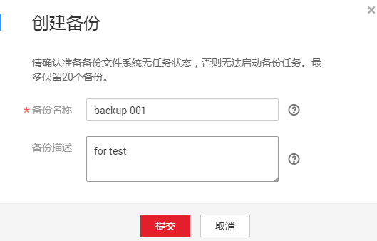
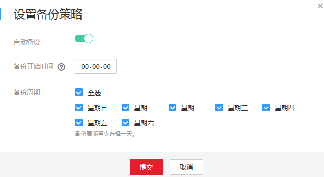
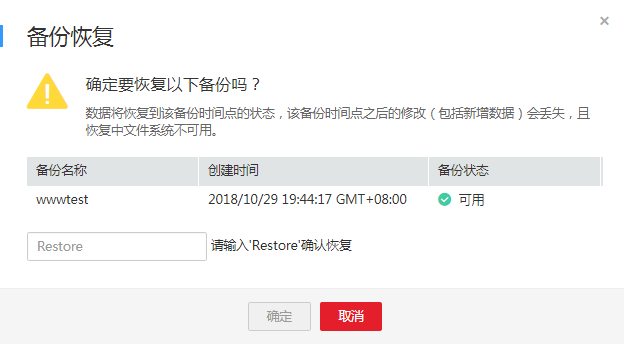

# 备份

目前仅SFS Turbo文件系统提供文件系统备份功能。最多保留20个备份，可以根据业务需求创建备份和备份策略。

目前备份功能已即将结束公测，后续请前往云备份界面对SFS Turbo文件系统进行备份，具体操作请参考[文件服务备份](https://support.huaweicloud.com/qs-cbr/cbr_02_0010.html)。

## 操作场景

备份是SFS Turbo文件系统在某一时间点的完整备份，记录了这一时刻文件系统的所有配置数据和业务数据。用户根据业务需要备份文件系统时，可以在“备份“页面创建文件系统的备份。

当您的文件系统出现故障或文件系统中的数据发生逻辑错误时（如误删数据、遭遇黑客攻击或病毒危害等），可快速使用备份恢复数据。

## 创建文件系统备份

请确认准备备份文件系统无任务状态，否则无法启动备份任务。此步骤介绍如何手动创建文件系统备份。

1.  登录弹性文件服务管理控制台。
2.  在文件系统列表中，找到待创建备份的SFS Turbo文件系统并单击目标文件系统名称，进入文件系统详情界面。
3.  在“备份“页签，单击“创建备份“。如[图1](#fig8453437202911)所示。

    **图 1**  创建备份  
    

4.  在创建备份对话框中，输入备份名称和描述，参数说明如[表1](#table11869527309)所示。

    **表 1**  参数说明

    
    <table><thead align="left"><tr id="row138618523302"><th class="cellrowborder" valign="top" width="17%" id="mcps1.2.4.1.1">
参数

    </th>
    <th class="cellrowborder" valign="top" width="55.00000000000001%" id="mcps1.2.4.1.2">
说明

    </th>
    <th class="cellrowborder" valign="top" width="28.000000000000004%" id="mcps1.2.4.1.3">
举例

    </th>
    </tr>
    </thead>
    <tbody><tr id="row1786352123012"><td class="cellrowborder" valign="top" width="17%" headers="mcps1.2.4.1.1 ">
备份名称

    </td>
    <td class="cellrowborder" valign="top" width="55.00000000000001%" headers="mcps1.2.4.1.2 ">
备份名称在4位到64位之间，必须以字母开头，不能以“auto”开头，可以包含字母、数字、中划线，不能包含其他的特殊字符。

    </td>
    <td class="cellrowborder" valign="top" width="28.000000000000004%" headers="mcps1.2.4.1.3 ">
backup-001

    </td>
    </tr>
    <tr id="row158615214302"><td class="cellrowborder" valign="top" width="17%" headers="mcps1.2.4.1.1 ">
备份描述

    </td>
    <td class="cellrowborder" valign="top" width="55.00000000000001%" headers="mcps1.2.4.1.2 ">
长度范围为0-64个字符，并且不能包含特殊字符“!”，“'”，“&lt;”，“&gt;”，“=”，“&amp;”，“"”。

    </td>
    <td class="cellrowborder" valign="top" width="28.000000000000004%" headers="mcps1.2.4.1.3 ">
for test

    </td>
    </tr>
    </tbody>
    </table>

5.  单击“确定”。
6.  系统会自动进行文件系统的备份。

    您可以在备份页面，查看备份创建状态。当文件系统备份的“备份状态”变为“可用”时，表示备份创建成功。

## 设置备份策略

除了在创建SFS Turbo文件系统时设置备份策略，还可以在文件系统详情界面进行创建。

自动备份策略开启后，系统会按照设定的时间和周期自动创建备份。

1.  登录管理控制台，选择“弹性文件服务“。
2.  在文件系统列表中，单击目标文件系统名称，进入文件系统详情界面。
3.  在“备份“页签，单击“设置备份策略“。如[图2](#fig1013895631520)所示。

    **图 2**  设置备份策略  
    

4.  单击“自动备份“的设置开关。

    表示开启备份策略，表示关闭备份策略，具体参数配置请参见[备份策略参数说明](https://support.huaweicloud.com/qs-sfs/zh-cn_topic_0034428727.html)。

5.  确认配置无误后，单击“提交“。
6.  再次单击“设置备份策略“，可以对已经开启的备份策略进行修改。不支持删除备份策略，不需要备份策略时将其关闭即可。

## 使用备份恢复文件系统

用户需要查看文件系统过去某个时刻的备份数据时，必须先使用备份恢复文件系统。备份状态需为“可用”状态。

使用备份恢复文件系统时，文件系统的数据将恢复到该备份时间点的状态，该备份时间点之后的修改（包括新增数据）会丢失。恢复过程中文件系统不可用，请谨慎操作。

1.  登录管理控制台，选择“弹性文件服务“。
2.  在文件系统列表中，单击目标文件系统名称，进入文件系统详情界面。
3.  在“备份“页签，单击目标备份“操作”列下的“恢复“。如[图3](#fig18132165164617)所示。

    **图 3**  备份恢复  
    

4.  确认恢复信息无误后，在文本框中输入“Restore”，最后单击“确定”。
5.  在备份列表中可以看到备份恢复状态，当备份状态由“恢复中”变为“可用”时，即恢复成功。

## 删除备份

当用户不再需要使用备份或备份状态为“不可用”时，可以将备份进行删除。删除成功的备份无法恢复，请谨慎操作。

1.  登录管理控制台，选择“弹性文件服务“。
2.  在文件系统列表中，单击目标文件系统名称，进入文件系统详情界面。
3.  在“备份“页签，单击目标备份“操作”列下的“删除“。
4.  确认删除信息无误后，在文本框中输入“Delete”，最后单击“确定”。
5.  在备份列表中查看文件系统是否删除成功。

