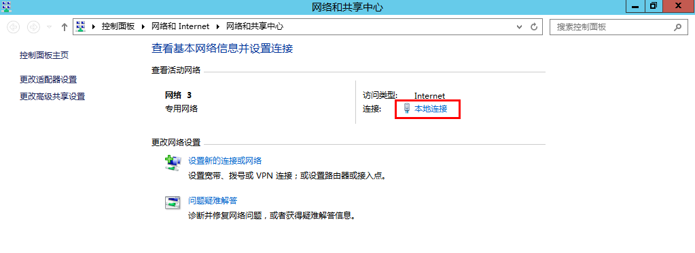
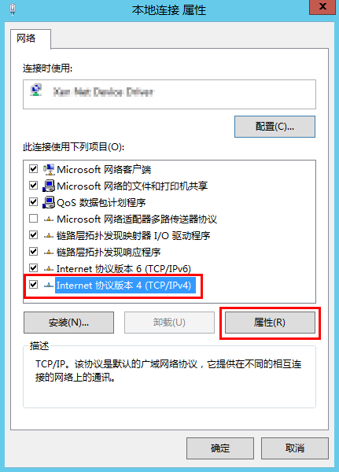

# 配置DNS<a name="sfs_01_0038"></a>

DNS服务器用于解析弹性文件服务中文件系统的域名。DNS服务器东北区IP地址为100.125.6.250，其它区域详情请参见[华为云内网DNS地址](https://support.huaweicloud.com/dns_faq/dns_faq_002.html)。

默认情况下，用于解析文件系统域名的DNS服务器的IP地址会在创建ECS时自动配置到ECS上，不需要人工配置。除非默认的DNS服务器的IP地址被修改，导致域名解析失败，才需要配置DNS的IP地址。

本章节Windows系统操作步骤部分以Windows 2012版本系统为例。

## Linux系统操作步骤<a name="section60237810114859"></a>

1.  以root用户登录云服务器。
2.  <a name="li13553756203149"></a>执行**vi /etc/resolv.conf**命令编辑“/etc/resolv.conf”文件。在已有的nameserver配置前写入DNS服务器的IP地址，如[图1](#fig3735131720121)所示。

    **图 1**  配置DNS<a name="fig3735131720121"></a>  
    

    格式如下：

    ```
    nameserver 100.125.1.250
    nameserver 100.125.17.29
    ```

3.  单击“Esc”，并输入**:wq**，保存退出。
4.  执行以下命令，查看IP地址是否写入成功。

    **cat /etc/resolv.conf**

5.  执行以下命令，验证文件系统域名是否可以解析到IP地址。

    **nslookup** _文件系统域名_

    > **说明：**   
    >文件系统域名请从文件系统的挂载地址中获取。  

6.  （可选）在使用DHCP服务的网络环境，需要对“/etc/resolv.conf”文件进行锁定设置，禁止文件在云服务器重启后进行自动修改。防止[2](#li13553756203149)中写入的DNS服务器的IP地址被重置。
    1.  执行如下命令，进行文件锁定设置。

        **chattr +i /etc/resolv.conf**

        > **说明：**   
        >如果需要再次对锁定文件进行修改，执行**chattr -i /etc/resolv.conf**命令，解锁文件。  

    2.  执行如下命令，验证是否设置成功。

        **lsattr /etc/resolv.conf**

        回显如[图 2 锁定状态的文件](#fig46855620155120)所示信息，表明文件处于锁定状态。

        **图 2**  锁定状态的文件<a name="fig46855620155120"></a>  
        


## Windows系统操作步骤<a name="section75976550455"></a>

1.  进入弹性云云服务器界面，登录已创建好的Windows 2012版本的弹性云服务器。
2.  单击左下角“这台电脑“，弹出“这台电脑“界面。
3.  右键单击“网络“，选择“属性“。弹出“网络和共享中心“，如[图3](#fig11811485719)所示。选择“本地连接“。

    **图 3**  网络和共享中心<a name="fig11811485719"></a>  
    

4.  在“活动“区域，选择“属性“。如[图4](#fig18980173031015)所示。

    **图 4**  本地连接活动<a name="fig18980173031015"></a>  
    

5.  弹出“本地连接属性“对话框，选择“Internet 协议版本 4 \(TCP/IPv4\)“，单击“属性“。如[图5](#fig146301518171620)所示。

    **图 5**  本地连接属性<a name="fig146301518171620"></a>  
    

6.  在弹出的“Internet 协议版本 4 \(TCP/IPv4\)属性“对话框中，选择“使用下面的DNS服务器地址“，如[图6](#fig82464042713)所示，根据需要配置DNS。DNS服务器东北区IP地址为100.125.6.250，其它区域详情请参见[华为云内网DNS地址](https://support.huaweicloud.com/dns_faq/dns_faq_002.html)。配置完成后，单击“确定“，完成配置。

    **图 6**  Windows系统配置DNS<a name="fig82464042713"></a>  
    


