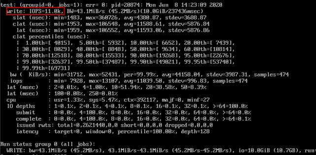

# SFS Turbo性能测试

fio是一个开源的I/O压力测试工具，可以使用 fio工具对SFS进行吞吐量和 IOPS的性能测试。

## 前提条件

已在云服务器上安装fio工具。fio可从[官网](http://freecode.com/projects/fio)或[GitHub](https://github.com/axboe/fio.git)下载。

## 注意和说明

测试性能依赖client和server之间的网络带宽及文件系统的容量大小。

## 安装fio

以Linux CentOS系统为例说明：

1.  在官网下载fio。

    **yum install fio**

2.  安装libaio引擎。

    **yum install libaio-devel**

3.  查看fio版本。

    **fio --version**

## 文件系统性能数据

SFS Turbo文件系统的性能主要有IOPS和吞吐量等指标，具体各指标数据参见[表1](#table1576820433218)。

**表 1**  性能数据表

<table><thead align="left"><tr id="row187694463212"><th class="cellrowborder" valign="top" width="24.771012931034488%" id="mcps1.2.4.1.1">
参数

</th>
<th class="cellrowborder" valign="top" width="37.796336206896555%" id="mcps1.2.4.1.2">
SFS Turbo标准型

</th>
<th class="cellrowborder" valign="top" width="37.43265086206897%" id="mcps1.2.4.1.3">
SFS Turbo性能型

</th>
</tr>
</thead>
<tbody><tr id="row1176917414323"><td class="cellrowborder" valign="top" width="24.771012931034488%" headers="mcps1.2.4.1.1 ">
最大容量

</td>
<td class="cellrowborder" valign="top" width="37.796336206896555%" headers="mcps1.2.4.1.2 ">
32TB

</td>
<td class="cellrowborder" valign="top" width="37.43265086206897%" headers="mcps1.2.4.1.3 ">
32TB

</td>
</tr>
<tr id="row18769145324"><td class="cellrowborder" valign="top" width="24.771012931034488%" headers="mcps1.2.4.1.1 ">
最大IOPS

</td>
<td class="cellrowborder" valign="top" width="37.796336206896555%" headers="mcps1.2.4.1.2 ">
5000

</td>
<td class="cellrowborder" valign="top" width="37.43265086206897%" headers="mcps1.2.4.1.3 ">
20000

</td>
</tr>
<tr id="row176912453218"><td class="cellrowborder" valign="top" width="24.771012931034488%" headers="mcps1.2.4.1.1 ">
最大吞吐量

</td>
<td class="cellrowborder" valign="top" width="37.796336206896555%" headers="mcps1.2.4.1.2 ">
150 MB/s

</td>
<td class="cellrowborder" valign="top" width="37.43265086206897%" headers="mcps1.2.4.1.3 ">
350 MB/s

</td>
</tr>
<tr id="row737513375331"><td class="cellrowborder" valign="top" width="24.771012931034488%" headers="mcps1.2.4.1.1 ">
IOPS性能计算公式

</td>
<td class="cellrowborder" valign="top" width="37.796336206896555%" headers="mcps1.2.4.1.2 ">
IOPS = min (5000, 1200 + 6 × 容量)

</td>
<td class="cellrowborder" valign="top" width="37.43265086206897%" headers="mcps1.2.4.1.3 ">
IOPS = min (20000, 1500 + 20 × 容量)

</td>
</tr>
</tbody>
</table>

**IOPS性能计算公式举例说明**

单个文件系统IOPS性能 =“最大IOPS”与“基线IOPS + 每GB文件系统的IOPS × 文件系统容量”的最小值。

以SFS Turbo性能型文件系统为例，单个SFS Turbo性能型文件系统的最大IOPS为20000。

-   假如SFS Turbo性能型文件系统容量为500 GB，则该文件系统IOPS性能 = min \(20000, 1500 + 20 × 500 \)，取20000与11500中的最小值，即该文件系统的IOPS性能为11500。
-   假如SFS Turbo性能型文件系统容量为1000 GB，则该文件系统IOPS性能 = min \(20000, 1500 + 20 × 1000 \)，取20000与21500中的最小值，即该文件系统的IOPS性能为20000。

## 通用测试配置样例

> **说明：**   
>以下提供的预估值为单台弹性云服务器ECS测试的结果。建议使用多台ECS测试，以达到[弹性文件服务](https://www.huaweicloud.com/product/sfs.html)的性能指标。  

本文以SFS Turbo性能型，云服务器规格如下为例说明。

规格：通用计算增强型 | c3.xlarge.4 | 4vCPUs | 16GB

镜像：CentOS 7.564bit

**混合读写，读写比例7:3**

-   fio命令：

    **fio --randrepeat=1 --ioengine=libaio --name=test -output=output.log --direct=1 --filename=_/mnt/nfs/test\_fio_  --bs=4k --iodepth=128 --size=10240M --readwrite=rw --rwmixwrite=30 --fallocate=none**

    > **说明：**   
    >其中，“**_/mnt/nfs/test\_fio_**”为待测试的目标文件的挂载路径，需具体到文件名，即这里要测试的是“**_/mnt/nfs_**”目录下的“**_test\_fio_**”文件，请根据实际填写。  

-   fio结果：

    

**混合读写，读写比例3:7**

-   fio命令：

    **fio --randrepeat=1 --ioengine=libaio --name=test -output=output.log --direct=1 --filename=_/mnt/nfs/test\_fio_  --bs=4k --iodepth=128 --size=10240M --readwrite=rw --rwmixwrite=70 --fallocate=none**

    > **说明：**   
    >其中，“**_/mnt/nfs/test\_fio_**”为待测试的目标文件的挂载路径，需具体到文件名，即这里要测试的是“**_/mnt/nfs_**”目录下的“**_test\_fio_**”文件，请根据实际填写。  

-   fio结果：

    

**读IOPS**

-   fio命令：

    **fio --randrepeat=1 --ioengine=libaio --name=test -output=output.log --direct=1 --filename=_/mnt/sfs-turbo/test\_fio_  --bs=4k --iodepth=128 --size=10240M --readwrite=read --fallocate=none**

    > **说明：**   
    >其中，“**_/mnt/sfs-turbo/test\_fio_**”为待测试的目标文件的挂载路径，需具体到文件名，即这里要测试的是“**_/mnt/sfs-turbo_**”目录下的“**_test\_fio_**”文件，请根据实际填写。  

-   fio结果：

    

**写IOPS**

-   fio命令：

    **fio --randrepeat=1 --ioengine=libaio --name=test -output=output.log --direct=1 --filename=_/mnt/sfs-turbo/test\_fio_  --bs=4k --iodepth=128 --size=10240M --readwrite=write --fallocate=none**

    > **说明：**   
    >其中，“**_/mnt/sfs-turbo/test\_fio_**”为待测试的目标文件的挂载路径，需具体到文件名，即这里要测试的是“**_/mnt/sfs-turbo_**”目录下的“**_test\_fio_**”文件，请根据实际填写。  

-   fio结果：

    

**读带宽**

-   fio命令：

    **fio --randrepeat=1 --ioengine=libaio --name=test -output=output.log --direct=1 --filename=_/mnt/sfs-turbo/test\_fio_  --bs=1M --iodepth=128 --size=10240M --readwrite=read --fallocate=none**

    > **说明：**   
    >其中，“**_/mnt/sfs-turbo/test\_fio_**”为待测试的目标文件的挂载路径，需具体到文件名，即这里要测试的是“**_/mnt/sfs-turbo_**”目录下的“**_test\_fio_**”文件，请根据实际填写。  

-   fio结果：

    

**写带宽**

-   fio命令：

    **fio --randrepeat=1 --ioengine=libaio --name=test -output=output.log --direct=1 --filename=_/mnt/sfs-turbo/test\_fio_  --bs=1M --iodepth=128 --size=10240M --readwrite=write --fallocate=none**

    > **说明：**   
    >其中，“**_/mnt/sfs-turbo/test\_fio_**”为待测试的目标文件的挂载路径，需具体到文件名，即这里要测试的是“**_/mnt/sfs-turbo_**”目录下的“**_test\_fio_**”文件，请根据实际填写。  

-   fio结果：

    

