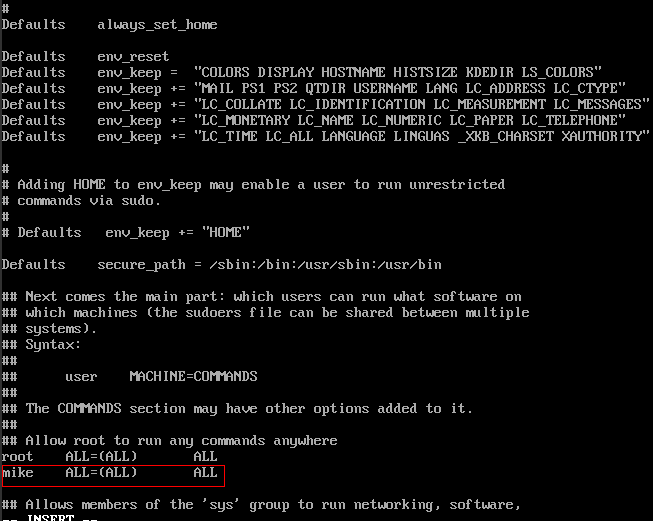

# 使用非root的普通用户挂载文件系统到Linux云服务器<a name="sfs_01_0100"></a>

## 使用场景<a name="section15512154184412"></a>

Linux操作系统的弹性云服务器默认只能通过root帐号使用mount命令进行挂载文件系统，但可通过赋予其他普通用户root权限，达到使非root的普通用户能够在弹性云服务器上使用mount命令挂载文件系统。以下操作以Euler OS系统的弹性云服务器为例介绍如何通过普通用户帐号将文件系统挂载到Linux云服务器。

## 操作前提<a name="section1689695774314"></a>

-   云服务器中已创建非root的普通用户。
-   已创建文件系统，并能通过root帐号成功挂载到云服务器上。
-   已获取到文件系统的挂载地址。

## 操作步骤<a name="section72201550134310"></a>

1.  以root帐号登录弹性云服务器。
2.  给非root的普通用户添加root权限。
    1.  执行**chmod 777 /etc/sudoers**命令修改sudoers文件权限为可编辑权限。
    2.  执行**vi /etc/sudoers**命令编辑sudoers文件。
    3.  在root帐号下添加普通用户帐号，下图以添加普通用户Mike为例。

        **图 1**  添加用户<a name="fig1615624682112"></a>  
        

    4.  编辑完成后，单击“Esc”，并输入**:wq**，保存文件并退出。
    5.  执行**chmod 440 /etc/sudoers**命令恢复sudoers文件权限为只读权限。

3.  切换到普通用户Mike登录弹性云服务器。
4.  执行如下命令挂载文件系统。挂载参数参见[表1](#table0741121164416)。

    **mount -t nfs -o vers=3,timeo=600,noresvport,nolock** _挂载地址_ _本地路径_

    **表 1**  参数说明

    <a name="table0741121164416"></a>
    <table><thead align="left"><tr id="row97431121124411"><th class="cellrowborder" valign="top" width="17.080000000000002%" id="mcps1.2.3.1.1"><p id="p188663294473"><a name="p188663294473"></a><a name="p188663294473"></a>参数</p>
    </th>
    <th class="cellrowborder" valign="top" width="82.92%" id="mcps1.2.3.1.2"><p id="p186592974715"><a name="p186592974715"></a><a name="p186592974715"></a>说明</p>
    </th>
    </tr>
    </thead>
    <tbody><tr id="row074372114417"><td class="cellrowborder" valign="top" width="17.080000000000002%" headers="mcps1.2.3.1.1 "><p id="p13301182412477"><a name="p13301182412477"></a><a name="p13301182412477"></a>挂载地址</p>
    </td>
    <td class="cellrowborder" valign="top" width="82.92%" headers="mcps1.2.3.1.2 "><p id="p173036243476"><a name="p173036243476"></a><a name="p173036243476"></a>SFS文件系统的格式为：文件系统域名:/路径，例如：example.com:/share-xxx。SFS Turbo文件系统的格式为：文件系统IP:/，例如192.168.0.0:/。</p>
    <div class="note" id="note1931112414478"><a name="note1931112414478"></a><a name="note1931112414478"></a><span class="notetitle"> 说明： </span><div class="notebody"><p id="p12312112413478"><a name="p12312112413478"></a><a name="p12312112413478"></a>x是数字或字母。</p>
    <p id="p203122243478"><a name="p203122243478"></a><a name="p203122243478"></a>由于挂载地址名称较长，需要拉宽该栏以便完整显示。</p>
    </div></div>
    </td>
    </tr>
    <tr id="row125621115134717"><td class="cellrowborder" valign="top" width="17.080000000000002%" headers="mcps1.2.3.1.1 "><p id="p1118632112125"><a name="p1118632112125"></a><a name="p1118632112125"></a>本地路径</p>
    </td>
    <td class="cellrowborder" valign="top" width="82.92%" headers="mcps1.2.3.1.2 "><p id="p10186182112124"><a name="p10186182112124"></a><a name="p10186182112124"></a>云服务器上用于挂载文件系统的本地路径，例如<span class="filepath" id="filepath15191192121212"><a name="filepath15191192121212"></a><a name="filepath15191192121212"></a>“/local_path”</span>。</p>
    </td>
    </tr>
    </tbody>
    </table>

5.  挂载完成后，执行如下命令，查看已挂载的文件系统。

    **mount -l**

    如果回显包含如下类似信息，说明挂载成功。

    ```
    example.com:/share-xxx on /local_path type nfs (rw,vers=3,timeo=600,nolock,addr=)
    ```


