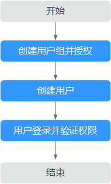

# 创建用户并授权使用SFS

如果您需要对您所拥有的SFS进行精细的权限管理，您可以使用统一身份认证服务（Identity and Access Management，简称IAM），通过IAM，您可以：

-   根据企业的业务组织，在您的华为云账号中，给企业中不同职能部门的员工创建IAM用户，让员工拥有唯一安全凭证，并使用SFS资源。
-   根据企业用户的职能，设置不同的访问权限，以达到用户之间的权限隔离。

如果华为云账号已经能满足您的要求，不需要创建独立的IAM用户，您可以跳过本章节，不影响您使用SFS服务的其它功能。

本章节为您介绍对用户授权的方法，操作流程如[图1](#fig625610403530)所示。

## 前提条件

给用户组授权之前，请您了解用户组可以添加的SFS系统策略，并结合实际需求进行选择，SFS支持的系统策略及策略间的对比，请参见：[SFS系统权限](https://support.huaweicloud.com/productdesc-sfs/sfs_01_0013.html)。若您需要对除SFS之外的其它服务授权，IAM支持服务的所有策略请参见[权限策略](https://support.huaweicloud.com/permissions/policy_list.html?product=sfs)。

## 使用限制

-   SFS文件系统适用于所有的SFS系统策略，以及创建的自定义策略。
-   SFS Turbo文件系统当前仅适用于以下系统策略，不支持创建的自定义策略。

    系统策略：SFS ReadOnlyAccess，SFS Turbo文件系统只读权限；SFS Administrator+VPC FullAccess，创建、修改、删除、查询SFS Turbo文件系统。

## 示例流程

**图 1**  给用户授权SFS权限流程  

1.  [创建用户组并授权](https://support.huaweicloud.com/usermanual-iam/iam_03_0001.html)

    在IAM控制台创建用户组，并授予弹性文件服务只读权限“SFS ReadOnlyAccess”。

2.  [创建用户并加入用户组](https://support.huaweicloud.com/usermanual-iam/iam_02_0001.html)

    在IAM控制台创建用户，并将其加入[1](#li539812235120)中创建的用户组。

3.  [用户登录](https://support.huaweicloud.com/usermanual-iam/iam_01_0552.html)并验证权限

    新创建的用户登录控制台，切换至授权区域，验证权限：

    -   在“服务列表”中选择弹性文件服务，进入SFS主界面，单击右上角“创建文件系统”，尝试创建文件系统，如果无法创建文件系统，表示“SFS ReadOnlyAccess”已生效。
    -   在“服务列表”中选择除弹性文件服务外的任一服务，若提示权限不足，表示“SFS ReadOnlyAccess”已生效。

