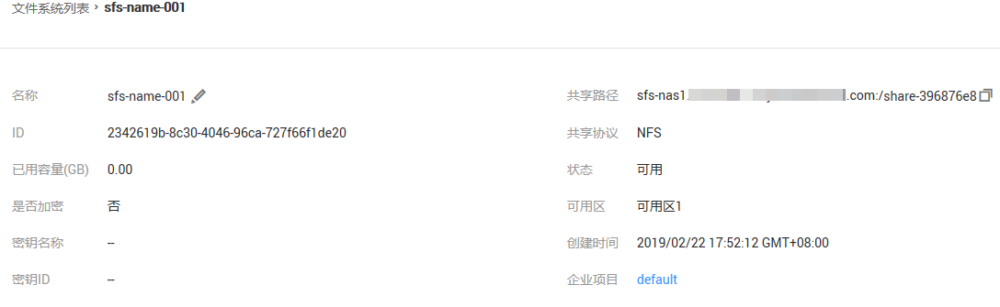
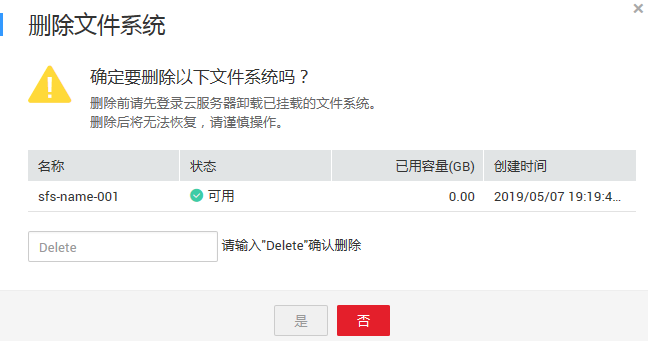

# 管理文件系统

## 查看文件系统

查看文件系统的基本信息，支持按文件系统名称关键字、按文件系统状态等不同过滤条件查看指定的文件系统。

## 操作步骤

1.  登录弹性文件服务管理控制台。
2.  在文件系统列表中查看所有文件系统的基本信息，参数说明如[表1](#table37365828114557)所示。

    **表 1**  参数说明

    
    <table><thead align="left"><tr id="row19122233114557"><th class="cellrowborder" valign="top" width="24.060000000000002%" id="mcps1.2.3.1.1">
参数

    </th>
    <th class="cellrowborder" valign="top" width="75.94%" id="mcps1.2.3.1.2">
说明

    </th>
    </tr>
    </thead>
    <tbody><tr id="row43511042114557"><td class="cellrowborder" valign="top" width="24.060000000000002%" headers="mcps1.2.3.1.1 ">
名称

    </td>
    <td class="cellrowborder" valign="top" width="75.94%" headers="mcps1.2.3.1.2 ">
已创建的文件系统名称，例如：sfs-name-001。

    </td>
    </tr>
    <tr id="row38769363537"><td class="cellrowborder" valign="top" width="24.060000000000002%" headers="mcps1.2.3.1.1 ">
可用区

    </td>
    <td class="cellrowborder" valign="top" width="75.94%" headers="mcps1.2.3.1.2 ">
文件系统所在的可用区。

    </td>
    </tr>
    <tr id="row20691380114557"><td class="cellrowborder" valign="top" width="24.060000000000002%" headers="mcps1.2.3.1.1 ">
状态

    </td>
    <td class="cellrowborder" valign="top" width="75.94%" headers="mcps1.2.3.1.2 ">
文件系统的状态，包含“可用”、“不可用”、“已冻结”、“正在创建”、“正在删除”、“删除错误”、“正在扩容”、“扩容错误”、“正在缩容”、“缩容错误”和“缩容失败”。

    </td>
    </tr>
    <tr id="row14779614193918"><td class="cellrowborder" valign="top" width="24.060000000000002%" headers="mcps1.2.3.1.1 ">
类型

    </td>
    <td class="cellrowborder" valign="top" width="75.94%" headers="mcps1.2.3.1.2 ">
文件系统的类型。

    </td>
    </tr>
    <tr id="row20249422122817"><td class="cellrowborder" valign="top" width="24.060000000000002%" headers="mcps1.2.3.1.1 ">
协议类型

    </td>
    <td class="cellrowborder" valign="top" width="75.94%" headers="mcps1.2.3.1.2 ">
文件系统的协议类型为NFS或CIFS。

    </td>
    </tr>
    <tr id="row194991729112817"><td class="cellrowborder" valign="top" width="24.060000000000002%" headers="mcps1.2.3.1.1 ">
已用容量(GB)

    </td>
    <td class="cellrowborder" valign="top" width="75.94%" headers="mcps1.2.3.1.2 ">
文件系统存放数据已使用的空间。

    
 说明： 

该数据不是实时数据，平均15分钟刷新一次。

    

    </td>
    </tr>
    <tr id="row38633965114557"><td class="cellrowborder" valign="top" width="24.060000000000002%" headers="mcps1.2.3.1.1 ">
最大容量（GB）

    </td>
    <td class="cellrowborder" valign="top" width="75.94%" headers="mcps1.2.3.1.2 ">
文件系统的最大使用容量。

    </td>
    </tr>
    <tr id="row15695362119"><td class="cellrowborder" valign="top" width="24.060000000000002%" headers="mcps1.2.3.1.1 ">
是否加密

    </td>
    <td class="cellrowborder" valign="top" width="75.94%" headers="mcps1.2.3.1.2 ">
已经创建的文件系统的加密状态，包括“是”和“否”。

    </td>
    </tr>
    <tr id="row13181382382"><td class="cellrowborder" valign="top" width="24.060000000000002%" headers="mcps1.2.3.1.1 ">
企业项目

    </td>
    <td class="cellrowborder" valign="top" width="75.94%" headers="mcps1.2.3.1.2 ">
文件系统归属的企业项目。

    </td>
    </tr>
    <tr id="row65429735114557"><td class="cellrowborder" valign="top" width="24.060000000000002%" headers="mcps1.2.3.1.1 ">
挂载地址

    </td>
    <td class="cellrowborder" valign="top" width="75.94%" headers="mcps1.2.3.1.2 ">
文件系统的挂载地址，NFS类型的格式为：文件系统域名:/路径，或文件系统IP:/；CIFS类型的格式为：\\文件系统域名\路径。

    
 说明： 

由于挂载地址名称较长，需要拉宽该栏以便完整显示。

    

    </td>
    </tr>
    <tr id="row27443506111522"><td class="cellrowborder" valign="top" width="24.060000000000002%" headers="mcps1.2.3.1.1 ">
操作

    </td>
    <td class="cellrowborder" valign="top" width="75.94%" headers="mcps1.2.3.1.2 ">
SFS包含“容量调整”、“查看监控指标”和“删除”操作。

    
SFS Turbo包含“删除”、“查看监控指标”、“续订”和“退订”操作。

    
 说明： 

包年/包月的SFS Turbo文件系统创建完成后，大约1到2分钟后，才能执行续订、退订等操作。

    

    </td>
    </tr>
    </tbody>
    </table>

3.  单击SFS文件系统名称，可查看更多的文件系统信息，如[图1](#fig164610249278)所示。

    **图 1**  文件系统的扩展信息  
    

4.  （可选）通过文件系统名称关键字、密钥ID或文件系统状态来过滤查看指定的文件系统。
    -   可以通过页面中间“所有项目”搜索框查询不同企业项目下的文件系统。

## 删除文件系统

文件系统删除后，文件系统中存放的数据将无法恢复。为避免数据丢失，执行删除操作前，请确认存放在该文件系统中的文件都已经在本地备份。

## 前提条件

删除文件系统之前，请先卸载已挂载的文件系统。卸载操作请参见[卸载文件系统](https://support.huaweicloud.com/qs-sfs/sfs_01_0026.html)。

## 操作步骤

1.  登录弹性文件服务管理控制台。
2.  在文件系统列表中，单击指定文件系统所在行的“更多 \> 删除”或“退订”。如果需要同时删除多个文件系统，则选中多个文件系统，单击列表左上方“删除”，在弹出对话框中确认删除信息无误后，在文本框中输入“Delete”，最后单击“是”。批量删除操作仅限删除SFS文件系统。
3.  SFS文件系统在[图2](#fig19173740194911)所示对话框中确认删除信息无误后，在文本框中输入“Delete”，最后单击“是”。SFS Turbo文件系统退订后，根据界面提示完成退订操作。

    > **说明：**   
    >仅“可用”或“不可用”状态的文件系统才能被删除或退订。  

    **图 2**  删除文件系统  
    

4.  在文件系统列表中查看文件系统是否删除成功。

